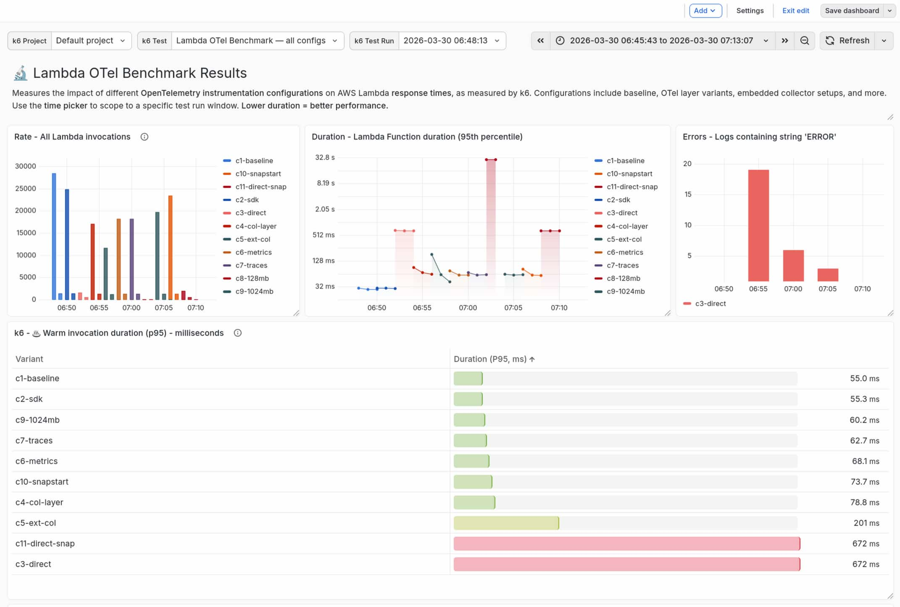

# AWS Lambda OpenTelemetry instrumentation benchmark

Benchmarking the latency cost of adding OpenTelemetry instrumentation to Lambda functions in multiple languages, shipping telemetry to an external observability platform via OTLP.

Includes an optional dashboard for Grafana Cloud, to visualise k6 test results and CloudWatch metrics together:



## Summary of findings

- Placing a Lambda in a VPC (so it can access a private otel-collector instance) can add significant latency to cold start times, due to the work required in setting up the network interface. [See Yan Cui's blog.](https://theburningmonk.com/2018/01/im-afraid-youre-thinking-about-aws-lambda-cold-starts-all-wrong/) 

## What it measures

A mock JWT-validation function (~25 ms of real work) is deployed in multiple variants that vary in instrumentation depth, exporter destination, memory allocated, and (for Java) whether SnapStart or Agent Fast Start are enabled. The same config matrix is deployed for each active language, so you can compare cold-start and warm latencies between different runtimes.

We use [k6](https://k6.io/) to load test each variant, to capture cold-start and warm p50/p99 latencies. The results are tagged by `config` (full function name) and `language` so you can slice any way you like in Grafana.

### Java configs (c01–c15)

| #  | Config                   | Export target                   | OTel Instrumentation | SnapStart | Memory  |
|----|--------------------------|---------------------------------|----------------------|-----------|---------|
| 1  | `c01-baseline-java`      | None                            | None                 | Off       | 512 MB  |
| 2  | `c02-sdk-java`           | None                            | Full (no export)     | Off       | 512 MB  |
| 3  | `c03-direct-java`        | External OTLP direct            | Full                 | Off       | 512 MB  |
| 4  | `c04-col-layer-java`     | Collector Lambda Layer          | Full                 | Off       | 512 MB  |
| 5  | `c05-ext-col-java`       | External ECS Collector (in VPC) | Full                 | Off       | 512 MB  |
| 6  | `c06-metrics-java`       | Collector Lambda Layer          | Metrics only         | Off       | 512 MB  |
| 7  | `c07-traces-java`        | Collector Lambda Layer          | Traces only          | Off       | 512 MB  |
| 8  | `c08-128mb-java`         | Collector Lambda Layer          | Full                 | Off       | 128 MB  |
| 9  | `c09-1024mb-java`        | Collector Lambda Layer          | Full                 | Off       | 1024 MB |
| 10 | `c10-snapstart-java`     | Collector Lambda Layer          | Full                 | On        | 512 MB  |
| 11 | `c11-direct-snap-java`   | External OTLP direct            | Full                 | On        | 512 MB  |
| 12 | `c12-fast-startup-java`  | Collector Lambda Layer          | Full (fast startup)  | Off       | 512 MB  |
| 13 | `c13-java-wrapper-java`  | Collector Lambda Layer          | Full (Java wrapper)  | Off       | 512 MB  |
| 14 | `c14-fast-snap-java`     | Collector Lambda Layer          | Full (fast startup)  | On        | 512 MB  |
| 15 | `c15-wrapper-snap-java`  | Collector Lambda Layer          | Full (Java wrapper)  | On        | 512 MB  |

### Python configs (c01–c09)

| #  | Config                    | Export target                   | OTel Instrumentation | Memory  |
|----|---------------------------|---------------------------------|----------------------|---------|
| 1  | `c01-baseline-python`     | None                            | None                 | 512 MB  |
| 2  | `c02-sdk-python`          | None                            | Full (no export)     | 512 MB  |
| 3  | `c03-direct-python`       | External OTLP direct            | Full                 | 512 MB  |
| 4  | `c04-col-layer-python`    | Collector Lambda Layer          | Full                 | 512 MB  |
| 5  | `c05-ext-col-python`      | External ECS Collector (in VPC) | Full                 | 512 MB  |
| 6  | `c06-metrics-python`      | Collector Lambda Layer          | Metrics only         | 512 MB  |
| 7  | `c07-traces-python`       | Collector Lambda Layer          | Traces only          | 512 MB  |
| 8  | `c08-128mb-python`        | Collector Lambda Layer          | Full                 | 128 MB  |
| 9  | `c09-1024mb-python`       | Collector Lambda Layer          | Full                 | 1024 MB |

## Prerequisites

- [AWS CLI](https://aws.amazon.com/cli/) configured with credentials for your target account
- Terraform >= 1.5
- Java 21 + Maven (required to build the Java function)
- Python 3.13 + zip (required to build the Python function)
- [k6](https://k6.io/)
- An external OTLP endpoint, to ship telemetry signals to. If you don't have access to one, you can deploy https://github.com/grafana/docker-otel-lgtm (not in scope for this repo)
- Grafana Cloud account (optional) - if you want to visualise the k6 test results and CloudWatch metrics together

## Deploy the function variants

### 1. Build the Lambda functions

Build the artifacts for the languages you intend to deploy before running Terraform. Terraform reads the built artifacts directly and will fail if they don't exist.

**Java:**

> Maven Wrapper was added to this project using `mvn wrapper:wrapper`.

```bash
cd functions/java
./mvnw package -q
```

It may produce a warning like _"a terminally deprecated method has been called"_, but you can safely ignore that.

**Python:**

```bash
cd functions/python
./build.sh
```

### 2. Configure Terraform

```bash
cd terraform
cp terraform.tfvars.example terraform.tfvars
# Edit terraform.tfvars — set deploy_java/deploy_python and fill in layer ARNs
```

- Set `otlp_endpoint`, `otlp_username`, `otlp_password` to the URL, HTTP basic auth username and password of your external observability platform
- Set `deploy_java = true` and/or `deploy_python = true` to control which language variants are deployed. You only need to provide layer ARNs for the languages you are deploying.
- If you want to use the included Grafana dashboard to visualise k6 and CloudWatch metrics, set `create_grafana_iam_user = true` to create a user so that Grafana can query your metrics.

### 3. Authenticate to AWS and apply

```bash
aws sso login --sso-session SESSION

export AWS_PROFILE=...
```

Then apply Terraform config:

```bash
terraform -chdir=terraform init
terraform -chdir=terraform apply
```

## Test the function variants

To test the function variants, use k6. You have the option of running it in three different modes:

- `k6 run`: k6 will test the services from your local machine, and save the results locally. Then you can inspect and interpret the results. 
- `k6 cloud run --local-execution`: k6 will test the services from your local machine, and write results to Grafana Cloud k6.
- `k6 cloud run`: k6 will upload the test to Grafana Cloud, run completely in the cloud and write the results to Grafana Cloud k6. 

Use the `cloud` options if you want to take advantage of the included dashboard in this repo, and view the test results alongside your CloudWatch metrics.

### Run load tests locally

Each run produces CSV output in `k6/results/`. You may also consider streaming the results to your own database - [see the k6 docs for more info](https://grafana.com/docs/k6/latest/get-started/results-output/).

Test just the baseline scenarios for Java and Python:

```bash
k6 run \
  --env NAME_PREFIX=$(terraform -chdir=terraform output -raw name_prefix) \
  --env C01_BASELINE_JAVA_URL=$(terraform -chdir=terraform output -raw config_01_java_url) \
  --env C01_BASELINE_PYTHON_URL=$(terraform -chdir=terraform output -raw config_01_python_url) \
  k6/benchmark-with-scenarios.js
```

### Run load tests with Grafana Cloud k6

You can run this test entirely within [Grafana Cloud's free tier](https://grafana.com/auth/sign-up). k6 usage is measured in VUh (virtual user-hours), and these tests fall within the included free usage.

Head to your Grafana Cloud instance > Testing and synthetics > Performance > Settings and grab your **Personal API token**, then:

```bash
k6 cloud login -t TOKEN --stack SLUG
```

Run the benchmark test for all Java configs (30m duration):

```bash
k6 cloud run \
  --env NAME_PREFIX=$(terraform -chdir=terraform output -raw name_prefix) \
  --env C01_BASELINE_JAVA_URL=$(terraform -chdir=terraform output -raw config_01_java_url) \
  --env C02_SDK_JAVA_URL=$(terraform -chdir=terraform output -raw config_02_java_url) \
  --env C03_DIRECT_JAVA_URL=$(terraform -chdir=terraform output -raw config_03_java_url) \
  --env C04_COL_LAYER_JAVA_URL=$(terraform -chdir=terraform output -raw config_04_java_url) \
  --env C05_EXT_COL_JAVA_URL=$(terraform -chdir=terraform output -raw config_05_java_url) \
  --env C06_METRICS_JAVA_URL=$(terraform -chdir=terraform output -raw config_06_java_url) \
  --env C07_TRACES_JAVA_URL=$(terraform -chdir=terraform output -raw config_07_java_url) \
  --env C08_128MB_JAVA_URL=$(terraform -chdir=terraform output -raw config_08_java_url) \
  --env C09_1024MB_JAVA_URL=$(terraform -chdir=terraform output -raw config_09_java_url) \
  --env C10_SNAPSTART_JAVA_URL=$(terraform -chdir=terraform output -raw config_10_java_url) \
  --env C11_DIRECT_SNAP_JAVA_URL=$(terraform -chdir=terraform output -raw config_11_java_url) \
  --env C12_FAST_STARTUP_JAVA_URL=$(terraform -chdir=terraform output -raw config_12_java_url) \
  --env C13_JAVA_WRAPPER_JAVA_URL=$(terraform -chdir=terraform output -raw config_13_java_url) \
  --env C14_FAST_SNAP_JAVA_URL=$(terraform -chdir=terraform output -raw config_14_java_url) \
  --env C15_WRAPPER_SNAP_JAVA_URL=$(terraform -chdir=terraform output -raw config_15_java_url) \
  k6/benchmark-with-scenarios.js
```

Run the benchmark test for all Python configs (18m duration, 24 VUh approx.):

```bash
k6 cloud run \
  --env NAME_PREFIX=$(terraform -chdir=terraform output -raw name_prefix) \
  --env C01_BASELINE_PYTHON_URL=$(terraform -chdir=terraform output -raw config_01_python_url) \
  --env C02_SDK_PYTHON_URL=$(terraform -chdir=terraform output -raw config_02_python_url) \
  --env C03_DIRECT_PYTHON_URL=$(terraform -chdir=terraform output -raw config_03_python_url) \
  --env C04_COL_LAYER_PYTHON_URL=$(terraform -chdir=terraform output -raw config_04_python_url) \
  --env C05_EXT_COL_PYTHON_URL=$(terraform -chdir=terraform output -raw config_05_python_url) \
  --env C06_METRICS_PYTHON_URL=$(terraform -chdir=terraform output -raw config_06_python_url) \
  --env C07_TRACES_PYTHON_URL=$(terraform -chdir=terraform output -raw config_07_python_url) \
  --env C08_128MB_PYTHON_URL=$(terraform -chdir=terraform output -raw config_08_python_url) \
  --env C09_1024MB_PYTHON_URL=$(terraform -chdir=terraform output -raw config_09_python_url) \
  k6/benchmark-with-scenarios.js
```

Run a cross-language comparison (just the baseline and full-instrumentation configs) (9m duration, 10 VUh approx.):

```bash
k6 cloud run \
  --env NAME_PREFIX=$(terraform -chdir=terraform output -raw name_prefix) \
  --env C01_BASELINE_JAVA_URL=$(terraform -chdir=terraform output -raw config_01_java_url) \
  --env C04_COL_LAYER_JAVA_URL=$(terraform -chdir=terraform output -raw config_04_java_url) \
  --env C01_BASELINE_PYTHON_URL=$(terraform -chdir=terraform output -raw config_01_python_url) \
  --env C04_COL_LAYER_PYTHON_URL=$(terraform -chdir=terraform output -raw config_04_python_url) \
  k6/benchmark-with-scenarios.js
```

Or, to run locally but publish results to Grafana Cloud k6, use the `--local-execution` flag:

```bash
k6 cloud run --local-execution \
  --env NAME_PREFIX=$(terraform -chdir=terraform output -raw name_prefix) \
  --env C01_BASELINE_JAVA_URL=$(terraform -chdir=terraform output -raw config_01_java_url) \
  --env C01_BASELINE_PYTHON_URL=$(terraform -chdir=terraform output -raw config_01_python_url) \
  k6/benchmark-with-scenarios.js
```

### Test a function manually

You can also send a single test request to each function individually using the AWS CLI:

```bash
aws lambda invoke \
  --region us-east-1 \
  --function-name otel-bench-c01-baseline-java \
  --payload '{}' /tmp/lambda-response.json 2>&1 && cat /tmp/lambda-response.json
```

And for Python:

```bash
aws lambda invoke \
  --region us-east-1 \
  --function-name otel-bench-c01-baseline-python \
  --payload '{}' /tmp/lambda-response.json 2>&1 && cat /tmp/lambda-response.json
```

Test a Python function which ships directly via OTLP:

```bash
aws lambda invoke \
  --region us-east-1 \
  --function-name otel-bench-c03-direct-python \
  --payload '{}' /tmp/lambda-response.json 2>&1 && cat /tmp/lambda-response.json
```

## Interpret the test results

### Locally

If you've run the tests entirely locally, then you'll find a CSV of results inside `k6/results` which includes metrics for latency of cold vs warm requests, passing/failing requests and so on.

Example first few lines of the results CSV:

```csv
config,language,metric,stat,value
otel-bench-c01-baseline-java,java,cold_start_duration_ms,med,1457.831732
otel-bench-c01-baseline-java,java,cold_start_duration_ms,max,1737.849357
otel-bench-c01-baseline-java,java,cold_start_duration_ms,p(90),1684.9525899999999
otel-bench-c01-baseline-java,java,cold_start_duration_ms,p(95),1728.3153255
otel-bench-c01-baseline-java,java,cold_start_duration_ms,p(99),1735.9425507
otel-bench-c01-baseline-java,java,cold_start_duration_ms,count,16
otel-bench-c01-baseline-java,java,cold_start_duration_ms,avg,1413.679725
otel-bench-c01-baseline-java,java,cold_start_duration_ms,min,647.774205
...
```

### Visualise test results & CloudWatch metrics in Grafana Cloud (optional)

This repo includes a dashboard which visualises the Grafana Cloud k6 test results and CloudWatch Lambda metrics side-by-side, so that you can compare how each scenario impacts both the client experience and your infrastructure metrics.

**NOTE: To see the test results in Grafana Cloud, you will need to run the load tests using `k6 cloud run` or `k6 cloud run --local-execution`.**

#### Set up AWS CloudWatch data source

All functions have CloudWatch Lambda Insights enabled. Metrics are available in
CloudWatch under the `LambdaInsights` namespace, so we'll set up the CloudWatch
data source in Grafana.

Get the generated access key and secret:

```bash
terraform -chdir=terraform output -raw grafana_cloudwatch_access_key_id
terraform -chdir=terraform output -raw grafana_cloudwatch_secret
```

In Grafana:

1. Go to **Connections → Data sources → Add data source → CloudWatch**.
2. Set **Authentication provider** to `Access & secret key`.
3. Paste the **Access key ID** and **Secret access key** from the Terraform outputs above.
4. Set **Default region** to `us-east-1`.
5. Click **Save & test** — you should see "Data source is working".

#### Install the dashboard

Upload the sample dashboard (`./dashboard.json`) to your Grafana Cloud instance.

#### Use the dashboard

Open the dashboard, then:

- Select your CloudWatch data source from the variable dropdowns
- Select your k6 Project, test and test run to see correlated client-side request metrics. 
- Use the `language` tag to filter by runtime, or the `config` tag to drill into a specific variant.

## Architecture

### Lambda Layer collector

Configs c04, c06, c07, c08, c09, c10 (Java) and c04, c06, c07, c08, c09 (Python)
use the OTel Collector running as a Lambda Extension (via the ADOT collector
layer). The function sends OTLP HTTP to `localhost:4318`; the extension forwards
to Grafana Cloud.

### External ECS collector

Config c05 deploys a standalone `otel/opentelemetry-collector-contrib` container
on ECS Fargate behind a Network Load Balancer. The Lambda sends OTLP HTTP to
the NLB's public DNS. This models the pattern where customers run their own
internal collectors before pushing to an external observability platform.

### Python instrumentation

Python configs use the AWS ADOT Python Lambda layer, which injects
instrumentation via `AWS_LAMBDA_EXEC_WRAPPER=/opt/otel-instrument`. The
function code itself has no OTel imports — instrumentation is entirely
layer-controlled, mirroring how the Java ADOT agent works.

## Status

Check what's actually deployed:

```bash
aws sso login --sso-session SESSION
export AWS_PROFILE=...
terraform -chdir=terraform state list
```

## Teardown

```bash
terraform -chdir=terraform destroy
```

## Architectural decisions

- **k6 tests are organised into scenarios:** so we can view all the results using a single query on a dashboard
- **each k6 scenario runs in sequence:** so that we avoid any doubt around resource contention between Lambda functions (there shouldn't be any, but this just makes sure of it)
- **language tag on every metric:** enables cross-language comparison in Grafana without needing separate test runs

## Sample results

All durations are p95, measured by k6 from the client side.

| #   | Config                             | Cold Start P95 — Java | Cold Start P95 — Python | Warm P95 — Java | Warm P95 — Python |
|-----|------------------------------------|-----------------------|-------------------------|-----------------|-------------------|
| c01 | Baseline (no instrumentation)      | —                     | 322 ms                  | —               | 52.5 ms           |
| c02 | OTel SDK, no export                | —                     | 1,570 ms                | —               | 53.8 ms           |
| c03 | Direct OTLP export                 | —                     | 3,060 ms                | —               | 1,260 ms          |
| c04 | Collector Lambda Layer             | —                     | 2,270 ms                | —               | 59.6 ms           |
| c05 | External ECS Collector (VPC)       | —                     | 1,840 ms                | —               | 105 ms            |
| c06 | Metrics only (Collector Layer)     | —                     | 2,200 ms                | —               | 56.1 ms           |
| c07 | Traces only (Collector Layer)      | —                     | 2,190 ms                | —               | 56.8 ms           |
| c08 | 128 MB memory (Collector Layer)    | —                     | 4,380 ms                | —               | 291 ms            |
| c09 | 1024 MB memory (Collector Layer)   | —                     | 2,220 ms                | —               | 58.6 ms           |
| c10 | SnapStart (Collector Layer)        | —                     | n/a                     | —               | n/a               |
| c11 | SnapStart + Direct OTLP            | —                     | n/a                     | —               | n/a               |
| c12 | Agent Fast Start (Collector Layer) | —                     | n/a                     | —               | n/a               |
| c13 | Java Wrapper (Collector Layer)     | —                     | n/a                     | —               | n/a               |
| c14 | Agent Fast Start + SnapStart       | —                     | n/a                     | —               | n/a               |
| c15 | Java Wrapper + SnapStart           | —                     | n/a                     | —               | n/a               |
